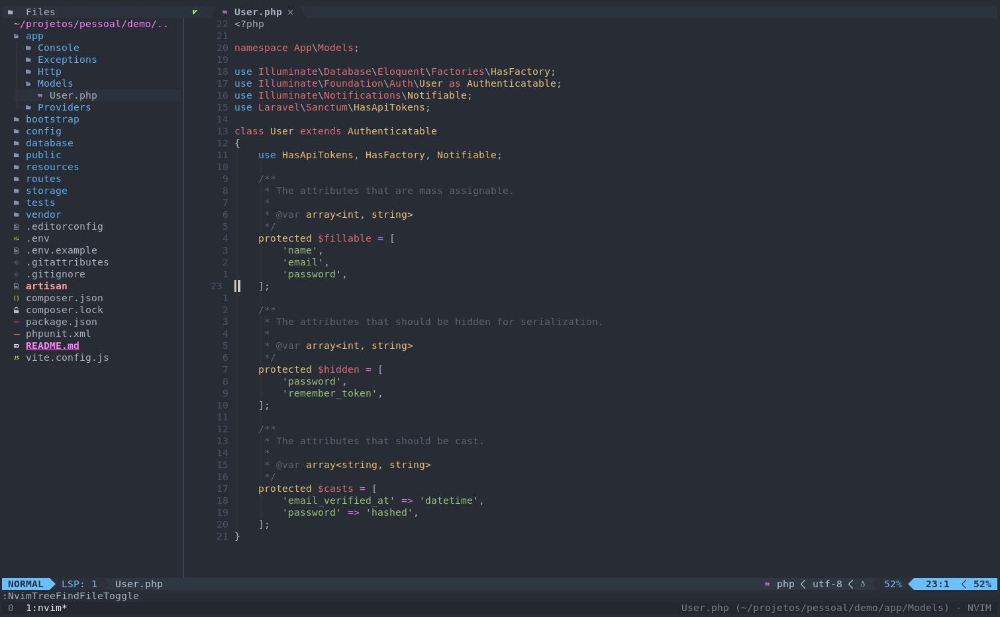

### Instalador dos meus arquivos dotfiles



<hr>

#### Como rodar

Clone este repositório
  
``` bash
$ git clone https://github.com/antonioanerao/dotfiles.git
```
    
Acesse a pasta do repositório, atriba permissão de execução para o arquivo _install_ e execute-o

``` bash
$ cd dotfile
$ chmod +x install
$ ./install
```

#### LSP a serem instalados

    #PHP
    $ npm install -g intelephense

    # Vue e JS
    $ npm install -g @volar/vue-language-server

    #Json
    $ npm i -g vscode-langservers-extracted

    #Dockerfile
    $ npm install -g dockerfile-language-server-nodejs

* Você pode testar minha configuração usando minha imagem docker de teste: https://hub.docker.com/r/antonioanerao/nvim-ide
